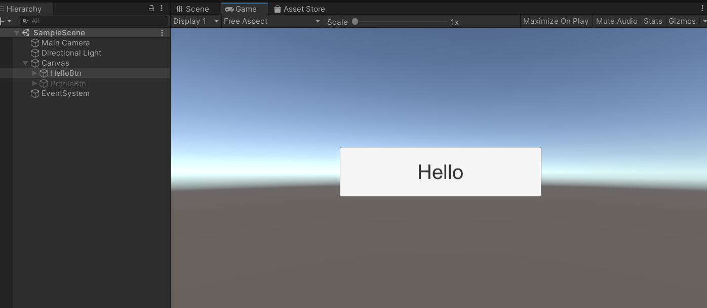

# ILVirtualMachine

### Brief
a simple implementation of virtual machine which can run il parsed by mono cecil.

### Hello World
open ```SampleScene``` and run it.  


click ```Hello``` button, you will see a log ```Hello World``` in the console: 


which is run by vm, not directly call.  

### How to use
see ```HelloBtn.cs```: 

load assembly by Mono.Cecil first (we default load assembly currently in use, you can replace it also):  
``` csharp
// default parse from: "Library/ScriptAssemblies/Assembly-CSharp.dll"
using (var assemblyHandle = new AssemblyHandle())
{
    // ...
}
```

get ```MethodDefinition``` of method which you want to invoke:  
``` csharp
// get MethodDefinition of HelloBtn.SayHello
var assemblyDef = assemblyHandle.GetAssembly();
var classTypeDef = assemblyDef.MainModule.GetType("HelloBtn");
var methodTypeDef = classTypeDef.Methods.First(m => m.Name == "SayHello");
```

invoke it by vm:  
``` csharp
var vm = new ILVirtualMachine();
var parameters = new object[] { this };
vm.Execute(methodTypeDef, parameters);
```

### C# Hotfix
you can treat this as a enhanced version of [Unity-CSharpHotfix](https://github.com/KJTang/Unity-CSharpHotfix).  
it can also replace c# method logic at runtime without stop unity play (and with less bugs).  

to do this, you need do:  
* compile: generate .dll with new method code, then rollback, we will hotfix old .dll by new one
* inject: add marks on method you want to modify later
* hotfix: run hotfix, then the method logic is replaced by new logic


#### Compile
for example, modify ```HelloBtn.cs``` as:  
``` csharp
// use ILVM.Hotfix to mark the method need be replaced
[ILVM.Hotfix]
public void OnClick()
{
    // these are new logic
    Debug.Log("Hello World after hotfix");

    
    // these are old logic
    // // default parse from: "Library/ScriptAssemblies/Assembly-CSharp.dll"
    // using (var assemblyHandle = new AssemblyHandle())
    // {
    //     // get MethodDefinition of HelloBtn.SayHello
    //     var assemblyDef = assemblyHandle.GetAssembly();
    //     var classTypeDef = assemblyDef.MainModule.GetType("HelloBtn");
    //     var methodTypeDef = classTypeDef.Methods.First(m => m.Name == "SayHello");

    //     // invoke method by Virual Machine
    //     var vm = new ILVirtualMachine();
    //     var parameters = new object[] { this };
    //     vm.Execute(methodTypeDef, parameters);
    // }
}  
```

compile code, we will get a new Assembly-CSharp.dll.  
move it to ```{project}/Library/ILVM``` folder,  
then rollback code modifications.  


#### Inject
you need add ```HelloBtn``` to ```ILVmInjectConfig.json```:  
``` json
{
  "injectClass": [
	"HelloBtn"
  ], 
"nameSpaceFilter": [
		"ILVM",
		"System", 
		"UnityEngine",  
		"UnityEditor" 
	], 
"classNameFilter": [
		"ConsoleProDebug"
	],
"methodNameFilter":  [
	]
}

```  
* injectClass: the class type you may hotfix later
* **Filter: blacklist, filter the namespace & class & method you dont want to hotfix. cause if there're too many, inject will run slowly.  


then click ```Unity Toolbar->ILVM->Inject```:  


#### Hotfix
play game, click hello btn, sill get ```Hello World``` in console:  
  

then click ```Unity Toolbar->ILVM->Hotfix```:  


we can get:  
  

also you can use ```Clear Hotfix``` to rollback to old logic.  